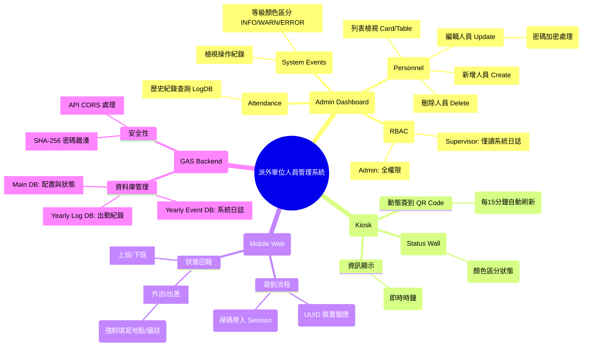

# 派外單位人員管理系統 - 功能樹狀圖 (Function Tree)

> **版本**: V4.0  
> **來源需求**: [SRS.md](./SRS.md)

## 1. 系統功能架構圖 (Mermaid Diagram)

## 2. 詳細功能清單 (Detailed Feature List)

### 3.1 管理員控制台 (Admin Dashboard)
- **活動日誌 (System Events)**
  - [ ] 顯示系統操作流水帳 (來源: `EventDB_YYYY`)
  - [ ] 支援依據 Level (INFO/WARN/ERROR) 篩選或著色
- **人員管理 (Personnel)** `[僅 Admin]`
  - [ ] **列表顯示**: 支援 Grid (卡片) 與 Table (條列) 模式切換
  - [ ] **新增人員**: 輸入姓名、帳號、部門、職稱、角色
  - [ ] **編輯人員**: 修改資料、重設密碼 (留空則不修改)
  - [ ] **刪除人員**: 軟刪除或標記停用，並寫入 Audit Log
- **出勤查詢 (Attendance)**
  - [ ] 查詢歷史打卡紀錄 (來源: `LogDB_YYYY`)
  - [ ] 支援依日期或與人員篩選

### 3.2 現場 Kiosk 電子看板
- **即時資訊**
  - [ ] **狀態牆**:顯示所有人員當前狀態 (上班/外出/下班/休假)
  - [ ] **時鐘**: 顯示伺服器標準時間
- **簽到入口**
  - [ ] **動態 QR Code**: 生成帶有時效性的 Token，供手機掃描
  - [ ] **自動刷新**: 每 15 秒更換一次 QR Code

### 3.3 行動裝置端 (Mobile Web)
- **身分驗證**
  - [ ] 掃描 Kiosk QR Code 進入
  - [ ] **裝置指紋校驗**: 比對 UUID 是否在庫 (DeviceMapping)
- **狀態更新**
  - [ ] **一般打卡**: 上班、下班、請假
  - [ ] **外勤打卡**: 選擇出差/公出，填寫「地點」與「說明」，若為公出則強制輸入時間區間

### 3.4 核心基礎設施 (Infrastructure)
- **資料分流 (Database Splitting)**
  - [ ] **Main DB**: 核心資料 (Personnel, Status, Config)
  - [ ] **History DBs**: 按年度封存 (EventDB_{Year}, LogDB_{Year})
- **安全性 (Security)**
  - [ ] **密碼雜湊**: 實作 SHA-256 加密存儲
  - [ ] **角色權限 (RBAC)**: 實作 Admin/Supervisor/Staff 權限中介層
